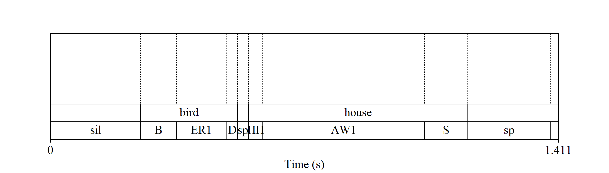
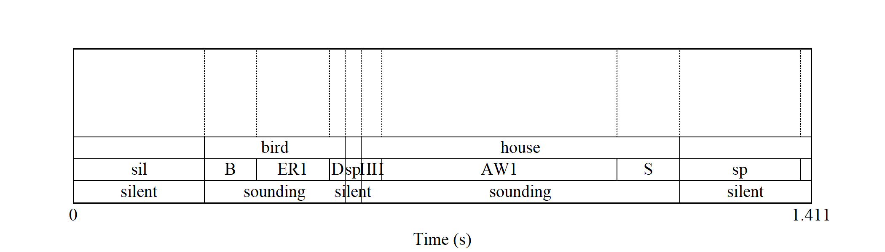

<!-- README.md is generated from README.Rmd. Please edit that file -->

# tjm.praat

<!-- badges: start -->
<!-- badges: end -->

The goal of tjm.praat is to make it easier to run
[Praat](http://www.fon.hum.uva.nl/praat/) scripts as part of an R
workflow. This package provides one main function `wrap_praat_script()`,
plus some scripts designed to work with this function. The name
`tjm.praat` indicates that the package houses my (tjm’s) `.praat` files.

## Installation

You can install tjm.praat from [GitHub](https://github.com/) with:

``` r
# install.packages("devtools")
devtools::install_github("tjmahr/tjm.praat")
```

## Example of wrapping a Praat script as a function

Let’s make a function that draws a Praat textgrid and saves the image as
`.png` file. First, let’s make the minimal working Praat script, and
store it as a string in R. We use `glue::glue()` because it cleans up
the leading and trailing blank lines and the indentations on the string.

``` r
script <- glue::glue(
  '
  form Draw a textgrid
    sentence Textgrid_in
    integer Width 6
    integer Height 4
    sentence Png_out
  endform

  Read from file: textgrid_in$
  Select outer viewport: 0, width, 0, height
  
  Draw: 0, 0, "yes", "yes", "yes"
  Save as 300-dpi PNG file: png_out$
  '
)
```

Now, we can convert this script into an R function. We tell
`wrap_praat_script()` to return the last argument of the script
(`png_out$` in this example) back to R after the script runs.

``` r
library(tjm.praat)

# Find where Praat lives on my machine
praat_location <- Sys.which("praat")

f_draw_textgrid <- wrap_praat_script(
  praat_location = praat_location, 
  script_code_to_run = script,
  return = "last-argument"
)
```

Now we set up the file arguments to script. First, we need a textgrid
file. Let’s use a textgrid bundled with the package. The textgrid shows
the results of a forced-alignment on the phrase “bird house”.

``` r
tg_in <- system.file(
  "demo-textgrids/birdhouse.TextGrid", 
  package = "tjm.praat"
)
```

We also need a place to save the image. I’m going to use a temporary
file.

``` r
png_out <- tempfile("birdhouse", fileext = ".png")
```

Shoot. I just forgot what the arguments are to this script. That’s okay,
we can use a helper function to view the form.

``` r
get_praat_form(script)
#> form Draw a textgrid
#>   sentence Textgrid_in
#>   integer Width 6
#>   integer Height 4
#>   sentence Png_out
#> endform
```

Oh that’s right. *Width* then *height*. Now, let’s call the function and
view the resulting image.

``` r
result <- f_draw_textgrid(tg_in, 7, 2, png_out)
magick::image_read(result) 
```



## Example using bundled Praat scripts

I have bundled some Praat scripts with this package. They are very
minimal and written under the assumption that the scripts would only
ever called via a Praat script.

In one of my projects, I needed to extract the silences identified by a
forced alignment algorithm. Thus, I needed to do three things for each
textgrid:

1.  Copy the tier with speech-sound intervals.
2.  Convert the speech-sound labels into “silence” and “sounding”.
3.  Merged adjacent “silence” intervals and “sounding” intervals
    together.

So I wrote a script for each of these steps. The last-argument of each
script is a Praat textgrid, so I can pipe these wrapped-script functions
into each other.

``` r
f_duplicate <- wrap_praat_script(praat_location, duplicate_tier)
f_relabel   <- wrap_praat_script(praat_location, convert_tier_to_silences)
f_merge     <- wrap_praat_script(praat_location, merge_duplicate_intervals)
```

Let’s apply these scripts to our original example textgrid.

``` r
library(magrittr, warn.conflicts = FALSE)

tg_out <- tempfile("demo", fileext = ".TextGrid")
png_out <- tempfile("demo", fileext = ".png")

tg_result <- tg_in %>% 
  f_duplicate("phones", "pauses", "last", tg_out) %>% 
  f_relabel("pauses", "^$|sil|sp", tg_out) %>% 
  f_merge("pauses", tg_out)

png_result <- f_draw_textgrid(tg_result, 7, 2, png_out)

magick::image_read(png_result)
```



Now, with a little [purrr](https://purrr.tidyverse.org/) magic, we could
run this workflow on thousands of textgrids 😉.

Finally, as a little test, I want to make sure the package works when
spaces appear in the file names.

``` r
tg_out <- tempfile("demo with spaces in name", fileext = ".TextGrid")
png_out <- tempfile("demo with spaces in name", fileext = ".png")

tg_result <- tg_in %>% 
  f_duplicate("phones", "pauses", "last", tg_out) %>% 
  f_relabel("pauses", "^$|sil|sp", tg_out) %>% 
  f_merge("pauses", tg_out)

png_result <- f_draw_textgrid(tg_result, 3.5, 2, png_out)
png_result
#> [1] "C:\\Users\\Tristan\\AppData\\Local\\Temp\\RtmpyCsmyA\\demo with spaces in name3e486f772e42.png"
```
